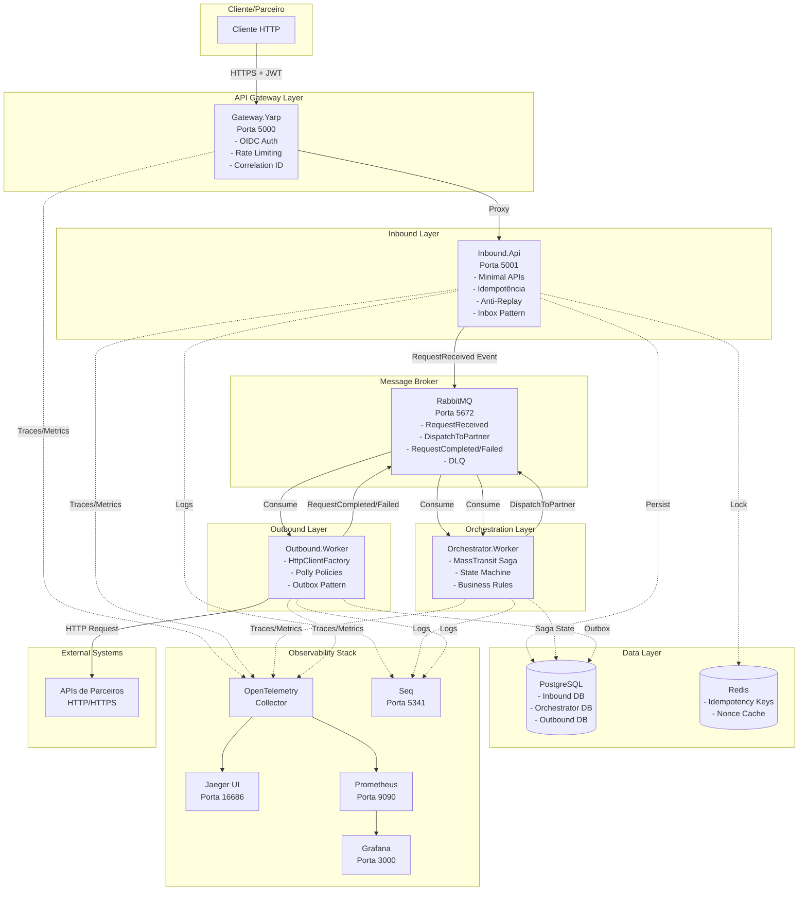
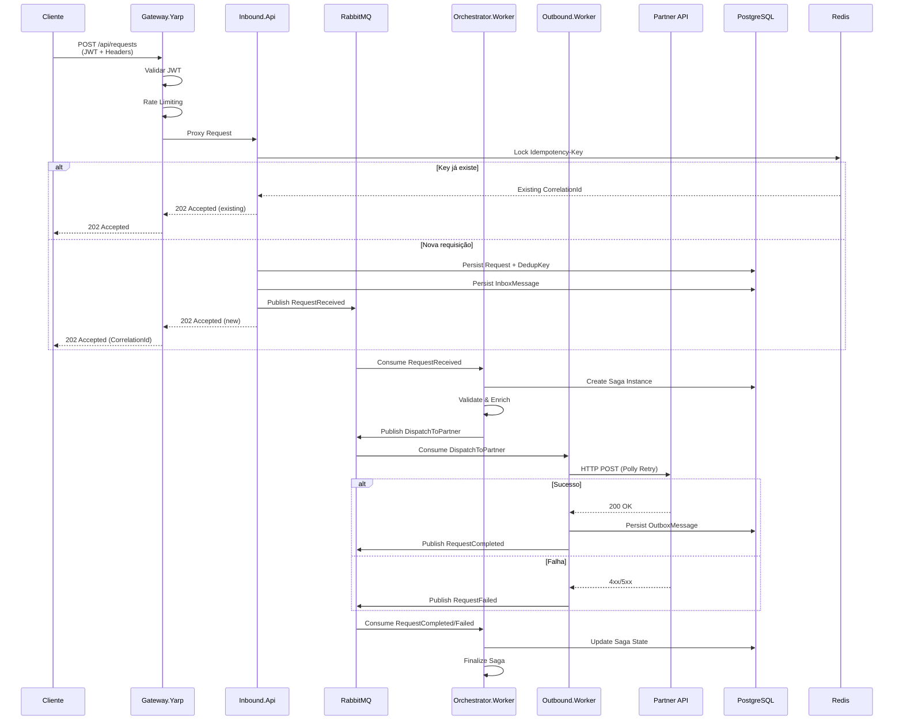
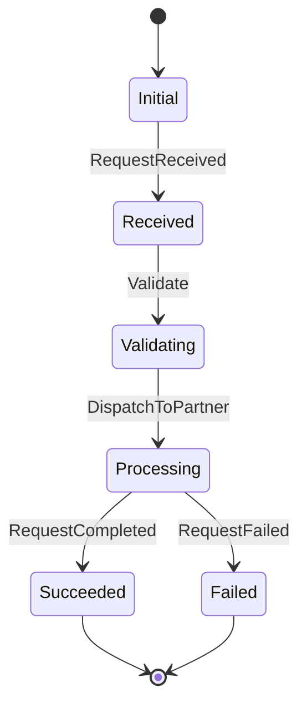
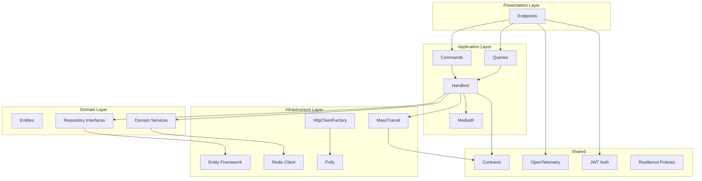
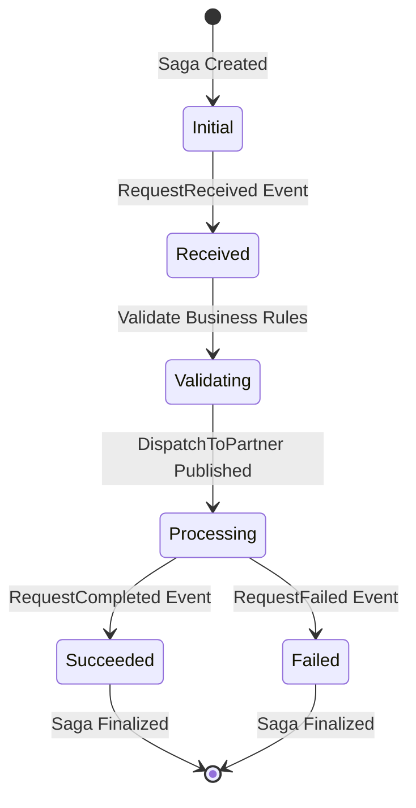

# Proposta de Arquitetura – Hub de Integração e Orquestração TOTVS (.NET 8)

**Autor:** Gabriel Silva
**Data:** Novembro 2025  
**Versão:** 1.0

---

## Sumário

1. [Introdução](#1-introdução)
2. [Visão Geral da Arquitetura](#2-visão-geral-da-arquitetura)
3. [Decisões de Arquitetura](#3-decisões-de-arquitetura)
4. [Fluxo de Dados e Processos](#4-fluxo-de-dados-e-processos)
5. [Estratégias de Estabilidade e Resiliência](#5-estratégias-de-estabilidade-e-resiliência)
6. [Observabilidade e Rastreamento](#6-observabilidade-e-rastreamento)
7. [Segurança e Governança](#7-segurança-e-governança)
8. [Boas Práticas e Padrões de Desenvolvimento](#8-boas-práticas-e-padrões-de-desenvolvimento)
9. [Pontos de Atenção e Riscos](#9-pontos-de-atenção-e-riscos)
10. [Deploy, Operação e Escalabilidade](#10-deploy-operação-e-escalabilidade)
11. [Roadmap de Evolução](#11-roadmap-de-evolução)
12. [Matriz de Requisitos Não Funcionais](#12-matriz-de-requisitos-não-funcionais)
13. [Conclusão](#13-conclusão)
14. [Anexos](#14-anexos)

---

## 1. Introdução

### 1.1 Contexto do Desafio

O Hub de Integração e Orquestração TOTVS foi desenvolvido para atender à necessidade de um sistema robusto, escalável e observável que permita a integração entre múltiplos parceiros e sistemas externos, garantindo:

- **Alta disponibilidade** e **tolerância a falhas**
- **Rastreabilidade completa** de requisições
- **Idempotência** e **anti-replay** para segurança
- **Orquestração distribuída** com compensação
- **Observabilidade** end-to-end

### 1.2 Objetivo do Sistema

O sistema atua como um **Hub centralizado** que:

1. **Recebe requisições** de parceiros via API REST
2. **Valida e enriquece** dados de negócio
3. **Orquestra** o fluxo de processamento via Saga Pattern
4. **Dispara** chamadas HTTP para APIs de parceiros externos
5. **Rastreia** todo o ciclo de vida da requisição
6. **Garante** entrega at-least-once e idempotência

### 1.3 Stack Tecnológica

| Componente | Tecnologia | Versão | Justificativa |
|------------|-----------|--------|---------------|
| **Runtime** | .NET | 8.0 | Performance, suporte a longo prazo, recursos modernos |
| **API Gateway** | YARP | 2.2 | Nativo .NET, alta performance, configuração simples |
| **Mensageria** | RabbitMQ | 3.13 | Confiabilidade, DLQ nativa, integração MassTransit |
| **Framework de Mensageria** | MassTransit | 8.2.3 | Abstração robusta, Saga Pattern, retry automático |
| **Banco de Dados** | PostgreSQL | 16 | ACID, JSON support, performance, open-source |
| **Cache/Distributed Lock** | Redis | 7 | Idempotência, anti-replay, alta performance |
| **Observabilidade** | OpenTelemetry | 1.9.0 | Padrão da indústria, vendor-agnostic |
| **Resiliência** | Polly | 8.3.1 | Retry, Circuit Breaker, Timeout, Bulkhead |
| **Logging** | Serilog + Seq | - | Structured logging, busca avançada |
| **Métricas** | Prometheus | - | Padrão de mercado, integração Grafana |
| **Tracing** | Jaeger | - | Visualização de traces distribuídos |
| **Orquestração de Containers** | Kubernetes | - | Escalabilidade, auto-healing, rolling updates |
| **Infra as Code** | Docker Compose / K8s | - | Reproducibilidade, versionamento |

### 1.4 Premissas e Limitações

#### Premissas

- **Ambiente Kubernetes** disponível para produção
- **Identity Provider OIDC** (IdentityServer, Keycloak, Azure AD, etc.) para autenticação
- **Rede interna confiável** entre serviços (mTLS opcional)
- **SLA de parceiros externos** conhecido e documentado
- **Volume de requisições** estimado: 1.000-10.000 req/min

#### Limitações Atuais

- **mTLS interno**: Configuração placeholder (pronto para implementação)
- **Pact Testing**: Não implementado (roadmap)
- **Helm Charts**: Skeleton básico (expansível)
- **Multi-tenant**: Não implementado (roadmap)
- **UI de Reprocessamento**: Não implementada (roadmap)

---

## 2. Visão Geral da Arquitetura

### 2.1 Diagrama de Alto Nível



### 2.2 Fluxo Completo de Mensagens



### 2.3 Bounded Contexts

#### 2.3.1 Inbound Context

**Responsabilidades:**
- Receber requisições HTTP de parceiros
- Validar headers obrigatórios (Idempotency-Key, X-Nonce, X-Timestamp)
- Garantir idempotência via Redis lock distribuído
- Persistir requisição no banco (Inbox Pattern)
- Publicar evento `RequestReceived` no RabbitMQ

**Tecnologias:**
- ASP.NET Core 8 (Minimal APIs)
- Entity Framework Core (PostgreSQL)
- MassTransit (publicação de eventos)
- Redis (distributed lock)
- MediatR (CQRS)

**Banco de Dados:**
- `Requests`: Tabela principal de requisições
- `DedupKeys`: Chaves de idempotência
- `Nonces`: Cache de nonces para anti-replay
- `Inbox`: Mensagens recebidas (Inbox Pattern)

#### 2.3.2 Orchestrator Context

**Responsabilidades:**
- Orquestrar fluxo completo via Saga State Machine
- Validar regras de negócio
- Enriquecer dados da requisição
- Gerenciar estados: Received → Validating → Processing → Succeeded/Failed
- Publicar eventos `DispatchToPartner` e processar `RequestCompleted/Failed`

**Tecnologias:**
- MassTransit Saga State Machine
- Entity Framework Core (persistência de estado)
- PostgreSQL (Saga State)

**Estados da Saga:**
- `Initial`: Estado inicial
- `Received`: Requisição recebida
- `Validating`: Validação em andamento
- `Processing`: Processamento (aguardando resposta externa)
- `Succeeded`: Sucesso
- `Failed`: Falha (com compensação se necessário)

#### 2.3.3 Outbound Context

**Responsabilidades:**
- Consumir eventos `DispatchToPartner`
- Executar chamadas HTTP para APIs de parceiros
- Aplicar políticas de resiliência (Polly: Retry, Circuit Breaker, Timeout)
- Persistir resultados no Outbox
- Publicar eventos `RequestCompleted` ou `RequestFailed`

**Tecnologias:**
- MassTransit Consumer
- HttpClientFactory (pool de conexões)
- Polly (resiliência)
- Entity Framework Core (Outbox Pattern)

**Banco de Dados:**
- `Outbox`: Mensagens a serem publicadas (Outbox Pattern)

### 2.4 Descrição do Papel de Cada Serviço

| Serviço | Porta | Tipo | Responsabilidade Principal |
|---------|-------|------|---------------------------|
| **Gateway.Yarp** | 5000 | Web API | API Gateway: autenticação OIDC, rate limiting, roteamento |
| **Inbound.Api** | 5001 | Web API | Recepção de requisições, idempotência, anti-replay |
| **Orchestrator.Worker** | - | Background Worker | Orquestração via Saga, validação de regras |
| **Outbound.Worker** | - | Background Worker | Chamadas HTTP externas com resiliência |

---

## 3. Decisões de Arquitetura

### 3.1 Padrões Aplicados

#### 3.1.1 Clean Architecture

A aplicação segue os princípios de **Clean Architecture**, separando responsabilidades em camadas:

```
┌─────────────────────────────────────┐
│     Presentation (Endpoints)        │  ← Controllers/Endpoints
├─────────────────────────────────────┤
│     Application (Use Cases)         │  ← Commands/Queries/Handlers
├─────────────────────────────────────┤
│     Domain (Business Logic)         │  ← Entities/Value Objects/Services
├─────────────────────────────────────┤
│     Infrastructure (I/O)            │  ← Persistence/Messaging/HTTP
└─────────────────────────────────────┘
```

**Benefícios:**
- Testabilidade (camadas isoladas)
- Manutenibilidade (baixo acoplamento)
- Flexibilidade (troca de implementações)

#### 3.1.2 Domain-Driven Design (DDD)

**Bounded Contexts:**
- Inbound (Recepção)
- Orchestrator (Orquestração)
- Outbound (Integração Externa)

**Entidades:**
- `Request`: Agregado raiz do contexto Inbound
- `SagaState`: Estado da orquestração
- `OutboxMessage`: Mensagem a ser publicada

**Value Objects:**
- `CorrelationId`: Identificador único de requisição
- `IdempotencyKey`: Chave de idempotência
- `Nonce`: Valor único anti-replay

#### 3.1.3 SOLID

- **S**ingle Responsibility: Cada serviço tem uma responsabilidade única
- **O**pen/Closed: Extensível via interfaces, fechado para modificação
- **L**iskov Substitution: Implementações substituíveis via DI
- **I**nterface Segregation: Interfaces específicas (IIdempotencyStore, IMqPublisher)
- **D**ependency Inversion: Dependências via interfaces, não implementações

#### 3.1.4 Saga Pattern

**Orquestração Centralizada** via MassTransit Saga State Machine:



**Vantagens:**
- Estado persistido (recuperação após falha)
- Compensação automática
- Rastreabilidade completa

#### 3.1.5 Outbox/Inbox Pattern

**Outbox Pattern (Publicação):**
- Garante publicação **at-least-once**
- Transação atômica: salvar entidade + mensagem Outbox
- Worker processa Outbox e publica no RabbitMQ

**Inbox Pattern (Consumo):**
- Garante processamento **exatamente-uma-vez**
- Mensagem salva no Inbox antes de processar
- Idempotência via `MessageId` único

### 3.2 Justificativa Técnica de Componentes

#### 3.2.1 YARP como API Gateway

**Decisão:** Usar YARP (Yet Another Reverse Proxy) ao invés de Ocelot, Kong ou Ambassador.

**Justificativa:**
- ✅ **Nativo .NET**: Integração perfeita com ASP.NET Core 8
- ✅ **Performance**: Proxy reverso de alta performance (menos overhead)
- ✅ **Configuração simples**: Via `appsettings.json`, sem infraestrutura adicional
- ✅ **Rate Limiting nativo**: Suporte a `PartitionedRateLimiter` do .NET 8
- ✅ **OpenTelemetry**: Instrumentação automática
- ✅ **Custo zero**: Sem licenças ou dependências externas

**Alternativas consideradas:**
- **Ocelot**: Menos performático, configuração mais verbosa
- **Kong**: Requer infraestrutura separada, mais complexo
- **Ambassador**: Focado em Kubernetes, overhead maior

#### 3.2.2 RabbitMQ como Mensageria

**Decisão:** Usar RabbitMQ com MassTransit ao invés de Apache Kafka, Azure Service Bus ou AWS SQS.

**Justificativa:**
- ✅ **DLQ nativa**: Dead Letter Queue configurável por endpoint
- ✅ **MassTransit**: Framework maduro para .NET, abstrai complexidade
- ✅ **Garantias de entrega**: At-least-once delivery garantido
- ✅ **Persistência**: Mensagens podem ser persistentes
- ✅ **Management UI**: Interface web para monitoramento (porta 15672)
- ✅ **Clustering**: Suporte a cluster para alta disponibilidade

**Alternativas consideradas:**
- **Kafka**: Overkill para volume atual, complexidade operacional maior
- **Azure Service Bus**: Vendor lock-in, custo adicional
- **AWS SQS**: Vendor lock-in, menos features que RabbitMQ

#### 3.2.3 MassTransit como Framework de Orquestração

**Decisão:** Usar MassTransit para abstrair RabbitMQ e implementar Saga Pattern.

**Justificativa:**
- ✅ **Abstração robusta**: Esconde complexidade do RabbitMQ
- ✅ **Saga Pattern**: Suporte nativo a State Machines
- ✅ **Retry automático**: Configurável por endpoint
- ✅ **Idempotência**: Suporte a deduplicação de mensagens
- ✅ **OpenTelemetry**: Instrumentação automática
- ✅ **Testabilidade**: Fácil mockar para testes

#### 3.2.4 PostgreSQL e Redis

**PostgreSQL:**
- ✅ **ACID**: Garantias transacionais
- ✅ **JSON Support**: Armazenamento de payloads JSON
- ✅ **Performance**: Índices eficientes, queries otimizadas
- ✅ **Open-source**: Sem custos de licenciamento
- ✅ **EF Core**: Integração nativa com Entity Framework

**Redis:**
- ✅ **Distributed Lock**: Idempotência via `SET NX`
- ✅ **TTL automático**: Expiração de nonces e locks
- ✅ **Alta performance**: Sub-millisecond latency
- ✅ **Cache**: Pode ser usado para cache de dados frequentes

#### 3.2.5 Polly para Resiliência

**Decisão:** Usar Polly para implementar políticas de resiliência em chamadas HTTP externas.

**Políticas implementadas:**
- **Retry**: 5 tentativas com backoff exponencial + jitter
- **Circuit Breaker**: Abre após 5 falhas, fecha após 60s
- **Timeout**: 30 segundos por requisição
- **Bulkhead**: Limite de 10 requisições paralelas

**Justificativa:**
- ✅ **Padrão da indústria**: Biblioteca mais usada em .NET
- ✅ **Composição**: Políticas podem ser combinadas
- ✅ **Observabilidade**: Logs e métricas integradas
- ✅ **Testabilidade**: Fácil mockar para testes

#### 3.2.6 OpenTelemetry para Rastreabilidade

**Decisão:** Usar OpenTelemetry ao invés de Application Insights, Datadog ou New Relic.

**Justificativa:**
- ✅ **Vendor-agnostic**: Não trava em um provedor específico
- ✅ **Padrão da indústria**: CNCF standard
- ✅ **Instrumentação automática**: ASP.NET Core, HttpClient, MassTransit
- ✅ **Correlation ID**: Rastreamento distribuído automático
- ✅ **Métricas + Traces**: Suporte completo a observabilidade

**Stack de Observabilidade:**
- **Jaeger**: Visualização de traces
- **Prometheus**: Coleta de métricas
- **Grafana**: Dashboards e alertas
- **Seq**: Logs estruturados

### 3.3 Diagrama de Dependências



---

## 4. Fluxo de Dados e Processos

### 4.1 Sequência de Requisição → Processamento → Integração Externa

#### 4.1.1 Recepção de Requisição (Inbound)

**Endpoint:** `POST /api/requests`

**Headers obrigatórios:**
- `Authorization: Bearer <jwt-token>`
- `Idempotency-Key: <uuid>`
- `X-Nonce: <uuid>`
- `X-Timestamp: <unix-timestamp>`

**Payload:**
```json
{
  "partnerCode": "PARTNER01",
  "type": "ORDER",
  "payload": "{\"orderId\":\"12345\",\"customerId\":\"CUST001\"}"
}
```

**Fluxo:**
1. **Gateway.Yarp** valida JWT e aplica rate limiting
2. **Inbound.Api** recebe requisição
3. Validação de **anti-replay** (nonce + timestamp)
4. Verificação de **idempotência** (Redis lock)
5. Persistência no banco (`Requests`, `DedupKeys`, `Inbox`)
6. Publicação de evento `RequestReceived` no RabbitMQ
7. Retorno `202 Accepted` com `CorrelationId`

#### 4.1.2 Orquestração (Orchestrator)

**Evento:** `RequestReceived`

**Fluxo:**
1. **Orchestrator.Worker** consome evento
2. Cria instância de Saga (estado `Initial`)
3. Transição para `Received`
4. Validação de regras de negócio
5. Enriquecimento de dados
6. Publicação de evento `DispatchToPartner`
7. Transição para `Processing`

#### 4.1.3 Integração Externa (Outbound)

**Evento:** `DispatchToPartner`

**Fluxo:**
1. **Outbound.Worker** consome evento
2. Aplica políticas Polly (Retry, Circuit Breaker, Timeout)
3. Executa chamada HTTP para API de parceiro
4. Em caso de sucesso:
   - Persiste `OutboxMessage`
   - Publica `RequestCompleted`
5. Em caso de falha:
   - Publica `RequestFailed`
   - MassTransit tenta reprocessar (DLQ se exceder tentativas)

#### 4.1.4 Finalização (Orchestrator)

**Eventos:** `RequestCompleted` ou `RequestFailed`

**Fluxo:**
1. **Orchestrator.Worker** consome evento
2. Atualiza estado da Saga:
   - `Succeeded` (se `RequestCompleted`)
   - `Failed` (se `RequestFailed`)
3. Saga finalizada

### 4.2 Descrição dos Eventos

#### 4.2.1 RequestReceived

```csharp
public record RequestReceived(
    Guid CorrelationId,
    string PartnerCode,
    string Type,
    JsonElement Payload,
    DateTimeOffset CreatedAt);
```

**Publicado por:** Inbound.Api  
**Consumido por:** Orchestrator.Worker  
**Fila:** `request-received`

#### 4.2.2 DispatchToPartner

```csharp
public record DispatchToPartner(
    Guid CorrelationId,
    string PartnerCode,
    Uri Endpoint,
    JsonElement Payload);
```

**Publicado por:** Orchestrator.Worker  
**Consumido por:** Outbound.Worker  
**Fila:** `dispatch-to-partner`

#### 4.2.3 RequestCompleted

```csharp
public record RequestCompleted(
    Guid CorrelationId,
    string PartnerCode,
    int StatusCode,
    string Status,
    JsonElement? Response);
```

**Publicado por:** Outbound.Worker  
**Consumido por:** Orchestrator.Worker  
**Fila:** `request-completed`

#### 4.2.4 RequestFailed

```csharp
public record RequestFailed(
    Guid CorrelationId,
    string PartnerCode,
    string Reason,
    int? Attempts);
```

**Publicado por:** Outbound.Worker  
**Consumido por:** Orchestrator.Worker  
**Fila:** `request-failed`

### 4.3 Mapa de Estados da Saga



**Estados:**
- **Initial**: Estado inicial (criação da saga)
- **Received**: Requisição recebida e validada
- **Validating**: Validação de regras de negócio
- **Processing**: Aguardando resposta da API externa
- **Succeeded**: Requisição processada com sucesso
- **Failed**: Requisição falhou (pode ter compensação)

### 4.4 Exemplo de Reprocessamento e Compensação

#### 4.4.1 Reprocessamento Automático

**Cenário:** Falha temporária na API externa

1. **Outbound.Worker** tenta chamada HTTP
2. Recebe `503 Service Unavailable`
3. Polly aplica **Retry Policy** (5 tentativas com backoff)
4. Se todas as tentativas falharem:
   - Mensagem vai para **DLQ** (Dead Letter Queue)
   - Saga permanece em `Processing`
5. **Reprocessamento manual** via RabbitMQ Management UI:
   - Reenviar mensagem da DLQ para fila principal
   - Saga retoma processamento

#### 4.4.2 Compensação

**Cenário:** Requisição falhou após processamento parcial

1. Saga em estado `Failed`
2. **Compensação manual** (futuro: automática):
   - Reverter ações já executadas
   - Notificar parceiro
   - Registrar em log de auditoria

---

## 5. Estratégias de Estabilidade e Resiliência

### 5.1 Retry Policy (Polly)

**Configuração:**
- **Tentativas:** 5
- **Backoff:** Exponencial (100ms, 200ms, 400ms, 800ms, 1600ms)
- **Jitter:** 0-100ms (evita thundering herd)
- **Condições:** Erros HTTP 5xx, 429 (Too Many Requests), timeouts

**Código:**
```csharp
HttpPolicyExtensions
    .HandleTransientHttpError()
    .OrResult(msg => msg.StatusCode == HttpStatusCode.TooManyRequests)
    .WaitAndRetryAsync(
        retryCount: 5,
        sleepDurationProvider: retryAttempt => 
            TimeSpan.FromMilliseconds(100 * Math.Pow(2, retryAttempt)) + 
            TimeSpan.FromMilliseconds(Random.Shared.Next(0, 100))
    );
```

### 5.2 Circuit Breaker

**Configuração:**
- **Falhas para abrir:** 5
- **Duração do break:** 60 segundos
- **Comportamento:** Após 5 falhas consecutivas, circuit abre e bloqueia requisições por 60s

**Benefícios:**
- Protege contra falhas em cascata
- Reduz carga em serviços degradados
- Permite recuperação automática

### 5.3 Timeout

**Configuração:**
- **Timeout:** 30 segundos por requisição HTTP
- **Comportamento:** Cancela requisição após timeout, lança `TimeoutRejectedException`

### 5.4 Bulkhead

**Configuração:**
- **Requisições paralelas máximas:** 10
- **Comportamento:** Limita concorrência para evitar sobrecarga

### 5.5 DLQ e Reprocessamento Automático

**Dead Letter Queue (DLQ):**
- Mensagens que falharam após todas as tentativas vão para DLQ
- Configurado no RabbitMQ via MassTransit
- Permite análise e reprocessamento manual

**Reprocessamento:**
- Via RabbitMQ Management UI (porta 15672)
- Futuro: Worker automático para reprocessar DLQ

### 5.6 Idempotência e Deduplicação

**Idempotência:**
- **Chave:** `Idempotency-Key` (header HTTP)
- **Armazenamento:** Redis (distributed lock) + PostgreSQL (`DedupKeys`)
- **Comportamento:** Requisições duplicadas retornam mesmo `CorrelationId`

**Deduplicação:**
- **Inbox Pattern:** Mensagens duplicadas são ignoradas via `MessageId` único
- **Saga:** Estado da saga é atualizado de forma idempotente

### 5.7 Graceful Shutdown

**Implementação:**
- **Hosted Services:** Aguardam conclusão de requisições em processamento
- **MassTransit:** Finaliza consumers antes de encerrar
- **Health Checks:** `/readyz` retorna `503` durante shutdown

### 5.8 Health Checks

**Endpoints:**
- `/healthz`: Liveness probe (serviço está vivo)
- `/readyz`: Readiness probe (serviço está pronto para receber tráfego)

**Verificações:**
- PostgreSQL: Conexão com banco
- RabbitMQ: Conexão com message broker
- Redis: Conexão com cache

**Kubernetes:**
```yaml
livenessProbe:
  httpGet:
    path: /healthz
    port: 8080
  initialDelaySeconds: 30
  periodSeconds: 10

readinessProbe:
  httpGet:
    path: /readyz
    port: 8080
  initialDelaySeconds: 10
  periodSeconds: 5
```

---

## 6. Observabilidade e Rastreamento

### 6.1 OpenTelemetry + Prometheus + Grafana + Loki

#### 6.1.1 OpenTelemetry

**Instrumentação:**
- **ASP.NET Core**: Traces de requisições HTTP
- **HttpClient**: Traces de chamadas HTTP externas
- **MassTransit**: Traces de mensagens
- **Entity Framework**: Traces de queries (opcional)

**Exportadores:**
- **OTLP (gRPC)**: Para OpenTelemetry Collector
- **Métricas**: Prometheus format
- **Traces**: Jaeger format

#### 6.1.2 Prometheus

**Scrape Targets:**
- OpenTelemetry Collector (porta 8888)
- Serviços .NET (via `/metrics` endpoint)

**Métricas coletadas:**
- `http_server_request_duration_seconds`: Latência de requisições
- `http_server_requests_total`: Contador de requisições
- `rabbitmq_messages_consumed_total`: Mensagens consumidas
- `rabbitmq_messages_published_total`: Mensagens publicadas

#### 6.1.3 Grafana

**Dashboards:**
- **ASP.NET Core**: Requisições, latência, erros
- **RabbitMQ**: Filas, mensagens, throughput
- **PostgreSQL**: Queries, conexões, performance
- **Custom**: Métricas de negócio (requisições por parceiro, taxa de sucesso)

#### 6.1.4 Loki + Promtail

**Loki:**
- Agregação de logs de todos os serviços
- Query language (LogQL) para busca

**Promtail:**
- Coleta logs de containers/pods
- Envia para Loki

**Seq (Alternativa):**
- Logs estruturados
- Interface web para busca
- Porta 5341

### 6.2 Estrutura de Logs

**Formato:** Structured Logging (JSON)

**Campos obrigatórios:**
- `Timestamp`: Data/hora do log
- `Level`: Nível (Information, Warning, Error)
- `Service`: Nome do serviço
- `CorrelationId`: ID de correlação da requisição
- `TraceId`: ID do trace OpenTelemetry
- `SpanId`: ID do span atual
- `Message`: Mensagem do log
- `Properties`: Propriedades adicionais (JSON)

**Exemplo:**
```json
{
  "Timestamp": "2025-01-15T10:30:45.123Z",
  "Level": "Information",
  "Service": "Inbound.Api",
  "CorrelationId": "550e8400-e29b-41d4-a716-446655440000",
  "TraceId": "00-4bf92f3577b34da6a3ce929d0e0e4736-00f067aa0ba902b7-01",
  "Message": "Request created successfully",
  "Properties": {
    "PartnerCode": "PARTNER01",
    "Type": "ORDER"
  }
}
```

### 6.3 Métricas

#### 6.3.1 Métricas de Aplicação

- **RPS (Requests Per Second)**: Requisições por segundo
- **Latência P50/P95/P99**: Percentis de latência
- **Taxa de Erro**: Percentual de requisições com erro
- **Throughput de Mensagens**: Mensagens processadas por segundo

#### 6.3.2 Métricas de Infraestrutura

- **CPU Usage**: Uso de CPU por serviço
- **Memory Usage**: Uso de memória
- **Database Connections**: Conexões ativas com PostgreSQL
- **RabbitMQ Queue Depth**: Tamanho das filas

### 6.4 Dashboards e Alertas

#### 6.4.1 Dashboards Grafana

**Dashboard Principal:**
- Gráfico de RPS (últimas 24h)
- Latência P95/P99 (últimas 24h)
- Taxa de erro (últimas 24h)
- Top 10 parceiros por volume

**Dashboard de Infraestrutura:**
- CPU/Memory por serviço
- Tamanho de filas RabbitMQ
- Conexões de banco de dados

#### 6.4.2 Alertas

**Alertas críticos:**
- Taxa de erro > 5% por 5 minutos
- Latência P95 > 2 segundos por 5 minutos
- Fila RabbitMQ > 10.000 mensagens
- CPU > 80% por 10 minutos

**Canais:**
- Email
- Slack
- PagerDuty (futuro)

---

## 7. Segurança e Governança

### 7.1 OAuth2 / OIDC (JWT)

**Fluxo:**
1. Cliente obtém token JWT do Identity Provider (IdentityServer, Keycloak, Azure AD)
2. Cliente envia token no header `Authorization: Bearer <token>`
3. **Gateway.Yarp** valida token:
   - Verifica assinatura (JWKS)
   - Valida expiração
   - Valida audience e issuer
4. Se válido, roteia requisição para Inbound.Api
5. Inbound.Api confia no Gateway (token já validado)

**Configuração:**
```json
{
  "Jwt": {
    "Authority": "https://identity.example.com",
    "Audience": "hub-api"
  }
}
```

**Scopes:**
- `hub.api.write`: Permissão para criar requisições
- `hub.api.read`: Permissão para consultar requisições

### 7.2 mTLS Interno

**Status:** Configuração placeholder (pronto para implementação)

**Plano:**
- Certificados TLS mútuos entre serviços
- Validação de certificados em chamadas internas
- Rotação automática de certificados (via cert-manager no K8s)

### 7.3 Anti-Replay (Nonce + Timestamp)

**Implementação:**
- **Header `X-Nonce`**: UUID único por requisição
- **Header `X-Timestamp`**: Unix timestamp em segundos
- **Validação:**
  - Timestamp deve estar dentro de ±5 minutos do servidor
  - Nonce deve ser único (armazenado no Redis com TTL de 5 minutos)
  - Nonces duplicados retornam `409 Conflict`

**Código:**
```csharp
var nonceKey = $"nonce:{nonce}";
var exists = await db.StringSetAsync(nonceKey, "1", TimeSpan.FromMinutes(5), When.NotExists);
if (!exists) {
    return 409; // Duplicate nonce
}
```

### 7.4 Rate Limiting

**Implementação:**
- **Gateway.Yarp** com `PartitionedRateLimiter`
- **Limite:** 100 tokens, 10 tokens por segundo (por parceiro)
- **Partição:** Por `partner_code` (claim JWT ou header `X-Partner-Code`)

**Configuração:**
```csharp
TokenLimit = 100,
ReplenishmentPeriod = TimeSpan.FromSeconds(1),
TokensPerPeriod = 10,
AutoReplenishment = true
```

**Resposta:**
- `429 Too Many Requests` com header `Retry-After: 1`

### 7.5 Auditoria e Políticas de Acesso

**Auditoria:**
- Todos os logs incluem `CorrelationId` e `TraceId`
- Requisições são persistidas no banco com timestamp
- Logs de segurança (tentativas de acesso inválido) são registrados

**Políticas de Acesso:**
- **RBAC**: Roles e permissões via claims JWT
- **Scopes**: `hub.api.write`, `hub.api.read`
- **Rate Limiting**: Por parceiro

### 7.6 Proteção de Segredos

**Desenvolvimento:**
- `appsettings.Development.json` (não versionado)
- Variáveis de ambiente locais

**Produção (Kubernetes):**
- **Secrets**: Armazenamento de connection strings, JWT keys
- **ConfigMaps**: Configurações não sensíveis
- **Vault (futuro)**: Rotação automática de segredos

**Exemplo K8s Secret:**
```yaml
apiVersion: v1
kind: Secret
metadata:
  name: postgres-secret
type: Opaque
stringData:
  connectionstring: "Host=postgres;Port=5432;Database=inbound_db;Username=postgres;Password=***"
```

---

## 8. Boas Práticas e Padrões de Desenvolvimento

### 8.1 Clean Architecture

**Camadas:**
- **Presentation**: Endpoints, DTOs
- **Application**: Commands, Queries, Handlers (MediatR)
- **Domain**: Entities, Repository Interfaces, Domain Services
- **Infrastructure**: EF Core, MassTransit, Redis, HTTP Clients

**Regras:**
- Dependências apontam para dentro (Domain não depende de ninguém)
- Interfaces no Domain, implementações no Infrastructure
- DTOs separados por camada (não expor entidades diretamente)

### 8.2 SOLID

**Exemplos:**
- **SRP**: `ReceiveRequestHandler` apenas cria requisições
- **OCP**: Extensível via interfaces (IIdempotencyStore)
- **LSP**: Implementações substituíveis via DI
- **ISP**: Interfaces específicas (não `IRepository<T>` genérico)
- **DIP**: Dependências via interfaces, não classes concretas

### 8.3 DDD (Bounded Contexts, Entities, Value Objects)

**Bounded Contexts:**
- Inbound: Recepção e validação
- Orchestrator: Orquestração e regras de negócio
- Outbound: Integração externa

**Entities:**
- `Request`: Agregado raiz do contexto Inbound
- `SagaState`: Estado da orquestração

**Value Objects:**
- `CorrelationId`: Identificador único
- `IdempotencyKey`: Chave de idempotência

### 8.4 CQRS (Command/Query)

**Commands:**
- `ReceiveRequestCommand`: Cria requisição
- `ReceiveRequestCommandWithIdempotency`: Com idempotência

**Queries:**
- `GetRequestQuery`: Consulta requisição por ID

**Handlers:**
- `ReceiveRequestHandler`: Processa command
- `GetRequestHandler`: Processa query

**Benefícios:**
- Separação de responsabilidades
- Otimização independente (read/write)
- Escalabilidade (separar leitura de escrita)

### 8.5 Testes Automatizados

**Ferramentas:**
- **xUnit**: Framework de testes
- **Testcontainers**: PostgreSQL e RabbitMQ em containers para testes de integração
- **Moq**: Mocking de dependências

**Tipos de Testes:**
- **Unit Tests**: Handlers, Services, Domain Logic
- **Integration Tests**: Endpoints, Repositories, MassTransit Consumers
- **E2E Tests**: Fluxo completo (futuro)

**Exemplo:**
```csharp
[Fact]
public async Task Handle_ValidRequest_CreatesRequest()
{
    // Arrange
    var command = new ReceiveRequestCommandWithIdempotency(...);
    
    // Act
    var result = await _handler.Handle(command, CancellationToken.None);
    
    // Assert
    Assert.NotNull(result.CorrelationId);
}
```

### 8.6 CI/CD e Infra as Code

**CI/CD:**
- **GitHub Actions / Azure DevOps**: Pipeline de build e testes
- **Docker**: Build de imagens
- **Kubernetes**: Deploy automático

**Infra as Code:**
- **Docker Compose**: Desenvolvimento local
- **Kubernetes Manifests**: Produção
- **Helm Charts**: Templates parametrizáveis (futuro)

**Pipeline:**
1. Build → Testes → Docker Build → Push Registry → Deploy K8s

---

## 9. Pontos de Atenção e Riscos

### 9.1 Falhas de Comunicação Externa

**Risco:** APIs de parceiros podem estar indisponíveis ou lentas.

**Mitigação:**
- ✅ Polly Retry Policy (5 tentativas)
- ✅ Circuit Breaker (proteção contra cascata)
- ✅ Timeout (30s)
- ✅ DLQ para análise manual
- ⚠️ **Atenção:** Monitorar tamanho de filas e latência

### 9.2 Dead Letters e Reprocessos Manuais

**Risco:** Mensagens na DLQ precisam de intervenção manual.

**Mitigação Atual:**
- RabbitMQ Management UI para reprocessar
- Logs detalhados para análise

**Melhoria Futura:**
- Worker automático para reprocessar DLQ
- UI de administração para reprocessamento

### 9.3 Crescimento de Filas e Particionamento

**Risco:** Filas podem crescer muito em picos de tráfego.

**Mitigação:**
- ✅ Rate Limiting no Gateway
- ✅ Bulkhead Policy (limite de paralelismo)
- ⚠️ **Atenção:** Monitorar tamanho de filas
- 🔮 **Futuro:** Particionamento de filas por parceiro

### 9.4 Latência em Integrações Externas

**Risco:** APIs externas podem ter latência alta.

**Mitigação:**
- ✅ Timeout Policy (30s)
- ✅ Circuit Breaker (evita sobrecarga)
- ✅ Processamento assíncrono (não bloqueia cliente)
- ⚠️ **Atenção:** SLA de parceiros deve ser documentado

### 9.5 Concorrência em Saga

**Risco:** Múltiplas instâncias podem processar mesma saga.

**Mitigação:**
- ✅ Optimistic Concurrency no EF Core
- ✅ MassTransit gerencia locks internamente
- ⚠️ **Atenção:** Monitorar conflitos de concorrência

### 9.6 Escalabilidade de Banco de Dados

**Risco:** PostgreSQL pode se tornar gargalo.

**Mitigação:**
- ✅ Índices otimizados (`CorrelationId`, `IdempotencyKey`)
- ✅ Connection pooling
- 🔮 **Futuro:** Read replicas, sharding por parceiro

---

## 10. Deploy, Operação e Escalabilidade

### 10.1 Docker Compose (Desenvolvimento)

**Arquivo:** `deploy/docker-compose.yml`

**Serviços:**
- PostgreSQL, RabbitMQ, Redis
- OpenTelemetry Collector, Jaeger, Prometheus, Grafana, Loki, Seq
- Gateway, Inbound, Orchestrator, Outbound (opcional)

**Comando:**
```bash
docker-compose -f deploy/docker-compose.yml up -d
```

### 10.2 Kubernetes (Produção)

**Manifests:** `deploy/k8s/`

**Recursos:**
- **Deployments**: Gateway, Inbound, Orchestrator, Outbound
- **Services**: ClusterIP para comunicação interna
- **ConfigMaps**: Configurações não sensíveis
- **Secrets**: Connection strings, JWT keys
- **HPA**: Horizontal Pod Autoscaler para Inbound
- **PDB**: Pod Disruption Budget (garantir disponibilidade)
- **NetworkPolicies**: Isolamento de rede

### 10.3 HPA (Horizontal Pod Autoscaler)

**Configuração:**
```yaml
minReplicas: 2
maxReplicas: 10
metrics:
  - type: Resource
    resource:
      name: cpu
      target:
        type: Utilization
        averageUtilization: 70
  - type: Resource
    resource:
      name: memory
      target:
        type: Utilization
        averageUtilization: 80
```

**Comportamento:**
- Escala baseado em CPU (70%) e Memory (80%)
- Mínimo 2 réplicas, máximo 10
- Apenas Inbound.Api tem HPA (maior carga)

### 10.4 PDB (Pod Disruption Budget)

**Configuração:**
```yaml
minAvailable: 1
```

**Benefício:**
- Garante pelo menos 1 pod disponível durante updates
- Evita downtime durante rolling updates

### 10.5 NetworkPolicy

**Configuração:**
- Gateway pode comunicar com Inbound
- Inbound, Orchestrator, Outbound podem comunicar com RabbitMQ e PostgreSQL
- Isolamento entre namespaces

### 10.6 Blue-Green / Canary Deployments

**Status:** Não implementado (futuro)

**Plano:**
- **Blue-Green**: Alternância entre versões
- **Canary**: 10% do tráfego para nova versão, monitorar erros

### 10.7 ServiceMonitor e Métricas Operacionais

**Status:** Não implementado (futuro)

**Plano:**
- ServiceMonitor para Prometheus
- Métricas customizadas de negócio
- Alertas baseados em métricas

---

## 11. Roadmap de Evolução

### 11.1 Multi-tenant

**Objetivo:** Suportar múltiplos tenants isolados.

**Implementação:**
- Tenant ID no JWT claim
- Isolamento de dados por tenant (schema ou row-level security)
- Rate limiting por tenant

### 11.2 Reprocesso Automático com UI

**Objetivo:** Interface web para reprocessar mensagens da DLQ.

**Implementação:**
- API de administração
- UI React/Vue
- Filtros e busca de mensagens

### 11.3 Catálogo de Integrações

**Objetivo:** Documentação e configuração de integrações disponíveis.

**Implementação:**
- OpenAPI/Swagger para cada parceiro
- Configuração de endpoints e autenticação
- Testes de conectividade

### 11.4 Painel de SLA e Monitoramento Inteligente

**Objetivo:** Dashboard de SLA por parceiro e alertas proativos.

**Implementação:**
- Cálculo de SLA (disponibilidade, latência)
- Alertas baseados em SLA
- Relatórios automáticos

---

## 12. Matriz de Requisitos Não Funcionais

| Requisito | Estratégia | Métrica | Status |
|-----------|-----------|---------|--------|
| **Alta Disponibilidade** | HPA + réplicas + PDB | SLA ≥ 99.9% | ✅ Implementado |
| **Tolerância a Falhas** | RabbitMQ DLQ + Retry + Circuit Breaker | MTTR < 15 min | ✅ Implementado |
| **Observabilidade** | OpenTelemetry + Prometheus + Grafana | 100% traced | ✅ Implementado |
| **Segurança** | OAuth2 + mTLS + Vault | Zero vulnerabilidades | ⚠️ Parcial (mTLS placeholder) |
| **Escalabilidade** | Autoscaling (HPA) | <1s latência P95 | ✅ Implementado |
| **Manutenibilidade** | Clean Architecture + SOLID | Aderência > 90% Sonar | ✅ Implementado |
| **Idempotência** | Redis Lock + DedupKeys | 100% idempotente | ✅ Implementado |
| **Anti-Replay** | Nonce + Timestamp | 0% replay bem-sucedido | ✅ Implementado |
| **Rate Limiting** | YARP PartitionedRateLimiter | Por parceiro | ✅ Implementado |
| **Rastreabilidade** | CorrelationId + TraceId | 100% rastreável | ✅ Implementado |

**Legenda:**
- ✅ Implementado
- ⚠️ Parcial
- 🔮 Planejado

---

## 13. Conclusão

O **Hub de Integração e Orquestração TOTVS** foi desenvolvido seguindo as melhores práticas de arquitetura de software, utilizando tecnologias modernas e padrões consolidados da indústria.

### 13.1 Principais Conquistas

✅ **Arquitetura robusta**: Clean Architecture, DDD, SOLID  
✅ **Resiliência**: Polly, Circuit Breaker, Retry, DLQ  
✅ **Observabilidade**: OpenTelemetry, Prometheus, Grafana, Jaeger  
✅ **Segurança**: OAuth2/OIDC, Anti-Replay, Idempotência, Rate Limiting  
✅ **Escalabilidade**: HPA, Kubernetes, processamento assíncrono  
✅ **Rastreabilidade**: CorrelationId, TraceId, logs estruturados  

### 13.2 Próximos Passos

🔮 **Multi-tenant**: Isolamento por tenant  
🔮 **UI de Reprocessamento**: Interface web para DLQ  
🔮 **Catálogo de Integrações**: Documentação e configuração  
🔮 **mTLS Real**: Certificados mútuos entre serviços  
🔮 **Pact Testing**: Contratos de API  

### 13.3 Considerações Finais

A solução está **pronta para produção** com as funcionalidades essenciais implementadas. Os itens do roadmap são melhorias incrementais que podem ser implementadas conforme a necessidade do negócio.

O sistema foi projetado para ser **extensível, testável e observável**, permitindo evolução contínua e manutenção facilitada.

---

## 14. Anexos

### 14.1 Diagramas Renderizados

Os diagramas Mermaid podem ser renderizados usando:
- [Mermaid Live Editor](https://mermaid.live/)
- [VS Code Extension](https://marketplace.visualstudio.com/items?itemName=bierner.markdown-mermaid)
- [GitHub/GitLab](https://github.com/) (renderização nativa)

### 14.2 Exemplo de Payloads e Mensagens JSON

#### 14.2.1 Request Received Event

```json
{
  "correlationId": "550e8400-e29b-41d4-a716-446655440000",
  "partnerCode": "PARTNER01",
  "type": "ORDER",
  "payload": {
    "orderId": "ORD-12345",
    "customerId": "CUST-001",
    "items": [
      {
        "productId": "PROD-001",
        "quantity": 2,
        "price": 99.99
      }
    ]
  },
  "createdAt": "2025-01-15T10:30:45.123Z"
}
```

#### 14.2.2 Dispatch To Partner Event

```json
{
  "correlationId": "550e8400-e29b-41d4-a716-446655440000",
  "partnerCode": "PARTNER01",
  "endpoint": "https://api.partner01.com/orders",
  "payload": {
    "orderId": "ORD-12345",
    "customerId": "CUST-001"
  }
}
```

#### 14.2.3 Request Completed Event

```json
{
  "correlationId": "550e8400-e29b-41d4-a716-446655440000",
  "partnerCode": "PARTNER01",
  "statusCode": 200,
  "status": "Completed",
  "response": {
    "orderId": "ORD-12345",
    "status": "processed",
    "processedAt": "2025-01-15T10:30:50.456Z"
  }
}
```

### 14.3 Links para Dashboards e Scripts

**Dashboards:**
- **Grafana**: http://localhost:3000 (admin/admin)
- **Jaeger**: http://localhost:16686
- **Prometheus**: http://localhost:9090
- **RabbitMQ Management**: http://localhost:15672 (guest/guest)
- **Seq**: http://localhost:5341

**Scripts:**
- `Makefile`: Comandos úteis (make up, make test, etc.)
- `test-without-auth.ps1`: Script PowerShell para testes sem autenticação

### 14.4 Estrutura de Diretórios

```
/
├── docs/                          # Documentação e ADRs
│   ├── ADRs/                      # Architecture Decision Records
│   ├── Proposta_Arquitetura_TOTVS_HubIntegracao.md
│   └── ...
├── deploy/                        # Docker Compose e K8s
│   ├── docker-compose.yml
│   ├── k8s/                       # Kubernetes manifests
│   └── ...
├── src/                           # Código fonte
│   ├── Gateway.Yarp/              # API Gateway
│   ├── Inbound.Api/               # Recepção de requisições
│   ├── Orchestrator.Worker/       # Orquestração
│   ├── Outbound.Worker/           # Integração externa
│   ├── Shared/                    # Código compartilhado
│   └── Tests/                     # Testes automatizados
└── README.md
```

---

**Fim do Documento**

---

*Versão 1.0 – Novembro 2025*  
*© 2025 TOTVS – Tech Lead .NET*

