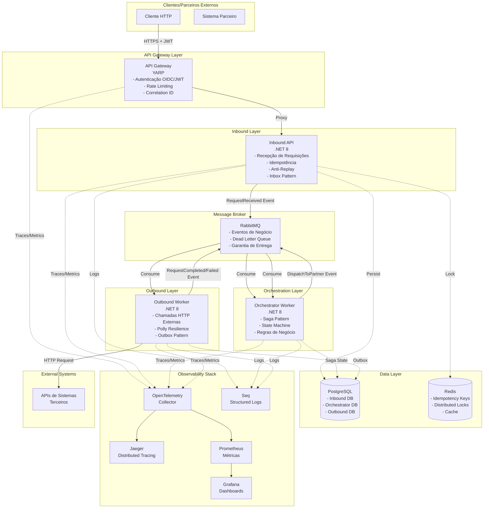
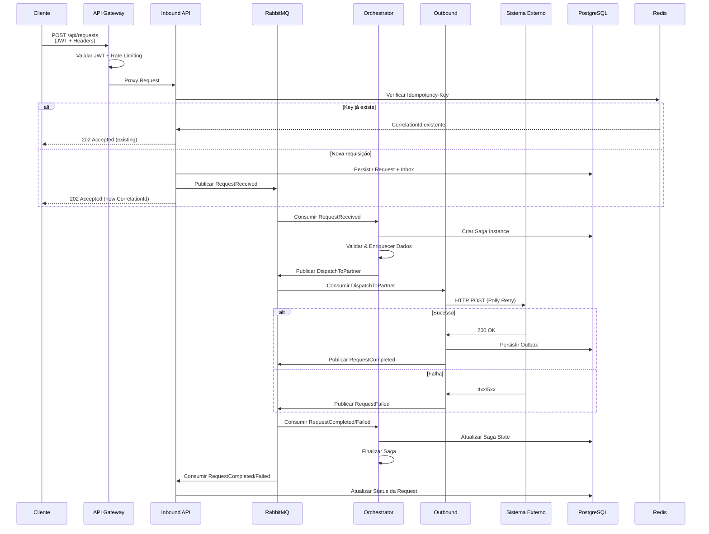

# TESTE TÉCNICO TOTVS - TECH LEAD .NET

## Proposta de Arquitetura para Sistema de Integração e Orquestração

**Autor:** [Seu Nome]  
**Data:** Janeiro 2025  
**Versão:** 1.0

---

## Sumário

1. [Contexto e Objetivo](#1-contexto-e-objetivo)
2. [Diagrama de Arquitetura (Alto Nível)](#2-diagrama-de-arquitetura-alto-nível)
3. [Justificativas Técnicas](#3-justificativas-técnicas)
4. [Estratégias para Estabilidade, Rastreabilidade e Segurança](#4-estratégias-para-estabilidade-rastreabilidade-e-segurança)
5. [Pontos de Atenção e Riscos](#5-pontos-de-atenção-e-riscos)
6. [Conclusão](#6-conclusão)

---

## 1. Contexto e Objetivo

### 1.1 Contexto

O sistema proposto atua como um **Hub de Integração e Orquestração** que centraliza a comunicação entre múltiplos sistemas terceiros, garantindo:

- **Recebimento de requisições externas** via APIs REST ou mensageria
- **Processamento interno** com aplicação de regras de negócio
- **Envio de dados** para sistemas externos de forma confiável
- **Gerenciamento de estados** e workflow das requisições

### 1.2 Objetivo

Propor uma arquitetura moderna, escalável e resiliente que atenda aos requisitos não funcionais:

- ✅ Alta disponibilidade e tolerância a falhas
- ✅ Observabilidade com logs estruturados e métricas
- ✅ Escalabilidade horizontal
- ✅ Segurança na comunicação entre sistemas
- ✅ Facilidade de manutenção e evolução

---

## 2. Diagrama de Arquitetura (Alto Nível)

### 2.1 Visão Geral do Sistema



### 2.2 Fluxo de Dados Detalhado



### 2.3 Componentes Principais

| Componente | Tecnologia | Responsabilidade |
|------------|-----------|------------------|
| **API Gateway** | YARP (.NET 8) | Autenticação, Rate Limiting, Roteamento |
| **Inbound API** | ASP.NET Core 8 | Recepção, Validação, Idempotência |
| **Orchestrator** | MassTransit Saga | Orquestração, Regras de Negócio |
| **Outbound Worker** | MassTransit + Polly | Integração Externa, Resiliência |
| **Message Broker** | RabbitMQ | Mensageria Assíncrona |
| **Database** | PostgreSQL | Persistência de Dados |
| **Cache** | Redis | Idempotência, Locks Distribuídos |
| **Observability** | OpenTelemetry + Prometheus + Grafana | Rastreabilidade e Métricas |

---

## 3. Justificativas Técnicas

### 3.1 Stack Tecnológica

#### 3.1.1 .NET 8

**Decisão:** Utilizar .NET 8 como runtime principal.

**Justificativa:**
- ✅ **Performance**: Melhorias significativas em performance (AOT, Native AOT)
- ✅ **Suporte de Longo Prazo**: LTS até 2026
- ✅ **Recursos Modernos**: Minimal APIs, Native AOT, HTTP/3
- ✅ **Ecosistema Maduro**: Bibliotecas robustas e bem testadas
- ✅ **Cross-platform**: Linux, Windows, macOS

#### 3.1.2 YARP como API Gateway

**Decisão:** YARP (Yet Another Reverse Proxy) ao invés de Ocelot, Kong ou Ambassador.

**Justificativa:**
- ✅ **Nativo .NET**: Integração perfeita com ASP.NET Core 8
- ✅ **Alta Performance**: Proxy reverso otimizado, baixo overhead
- ✅ **Configuração Simples**: Via `appsettings.json`, sem infraestrutura adicional
- ✅ **Rate Limiting Nativo**: Suporte a `PartitionedRateLimiter` do .NET 8
- ✅ **OpenTelemetry**: Instrumentação automática
- ✅ **Custo Zero**: Sem licenças ou dependências externas

**Alternativas Consideradas:**
- **Ocelot**: Menos performático, configuração mais verbosa
- **Kong**: Requer infraestrutura separada, maior complexidade operacional
- **Ambassador/Emissary**: Focado em Kubernetes, overhead maior

#### 3.1.3 RabbitMQ + MassTransit

**Decisão:** RabbitMQ como message broker com MassTransit como framework de abstração.

**Justificativa:**
- ✅ **DLQ Nativa**: Dead Letter Queue configurável por endpoint
- ✅ **MassTransit**: Framework maduro para .NET, abstrai complexidade do RabbitMQ
- ✅ **Garantias de Entrega**: At-least-once delivery garantido
- ✅ **Persistência**: Mensagens podem ser persistentes (durabilidade)
- ✅ **Management UI**: Interface web para monitoramento (porta 15672)
- ✅ **Clustering**: Suporte a cluster para alta disponibilidade
- ✅ **Saga Pattern**: Suporte nativo via MassTransit State Machine

**Alternativas Consideradas:**
- **Apache Kafka**: Overkill para volume atual, complexidade operacional maior
- **Azure Service Bus**: Vendor lock-in, custo adicional
- **AWS SQS**: Vendor lock-in, menos features que RabbitMQ

#### 3.1.4 PostgreSQL

**Decisão:** PostgreSQL como banco de dados relacional.

**Justificativa:**
- ✅ **ACID**: Garantias transacionais completas
- ✅ **JSON Support**: Armazenamento nativo de payloads JSON (JSONB)
- ✅ **Performance**: Índices eficientes, queries otimizadas
- ✅ **Open-source**: Sem custos de licenciamento
- ✅ **EF Core**: Integração nativa com Entity Framework Core
- ✅ **Escalabilidade**: Suporte a read replicas, particionamento

#### 3.1.5 Redis

**Decisão:** Redis para idempotência, distributed locks e cache.

**Justificativa:**
- ✅ **Distributed Lock**: Idempotência via `SET NX` (SET if Not eXists)
- ✅ **TTL Automático**: Expiração automática de nonces e locks
- ✅ **Alta Performance**: Sub-millisecond latency
- ✅ **Cache**: Pode ser usado para cache de dados frequentes
- ✅ **Atomic Operations**: Operações atômicas garantem consistência

#### 3.1.6 Polly para Resiliência

**Decisão:** Polly para implementar políticas de resiliência em chamadas HTTP externas.

**Justificativa:**
- ✅ **Padrão da Indústria**: Biblioteca mais usada em .NET para resiliência
- ✅ **Composição**: Políticas podem ser combinadas (Retry + Circuit Breaker + Timeout)
- ✅ **Observabilidade**: Logs e métricas integradas
- ✅ **Testabilidade**: Fácil mockar para testes

**Políticas Implementadas:**
- **Retry**: 5 tentativas com backoff exponencial + jitter
- **Circuit Breaker**: Abre após 5 falhas, fecha após 60s
- **Timeout**: 30 segundos por requisição
- **Bulkhead**: Limite de 10 requisições paralelas

#### 3.1.7 OpenTelemetry para Observabilidade

**Decisão:** OpenTelemetry ao invés de Application Insights, Datadog ou New Relic.

**Justificativa:**
- ✅ **Vendor-agnostic**: Não trava em um provedor específico
- ✅ **Padrão da Indústria**: CNCF standard, amplamente adotado
- ✅ **Instrumentação Automática**: ASP.NET Core, HttpClient, MassTransit
- ✅ **Correlation ID**: Rastreamento distribuído automático
- ✅ **Métricas + Traces**: Suporte completo a observabilidade

**Stack de Observabilidade:**
- **Jaeger**: Visualização de traces distribuídos
- **Prometheus**: Coleta de métricas
- **Grafana**: Dashboards e alertas
- **Seq**: Logs estruturados (alternativa: Loki + Promtail)

### 3.2 Padrões Arquiteturais

#### 3.2.1 Clean Architecture

**Decisão:** Aplicar princípios de Clean Architecture.

**Justificativa:**
- ✅ **Testabilidade**: Camadas isoladas, fácil mockar dependências
- ✅ **Manutenibilidade**: Baixo acoplamento, alta coesão
- ✅ **Flexibilidade**: Troca de implementações sem impacto no domínio
- ✅ **Independência de Frameworks**: Lógica de negócio não depende de bibliotecas externas

**Estrutura de Camadas:**
```
┌─────────────────────────────────────┐
│     Presentation (Endpoints)        │  ← Controllers/Endpoints
├─────────────────────────────────────┤
│     Application (Use Cases)         │  ← Commands/Queries/Handlers
├─────────────────────────────────────┤
│     Domain (Business Logic)         │  ← Entities/Value Objects/Services
├─────────────────────────────────────┤
│     Infrastructure (I/O)            │  ← Persistence/Messaging/HTTP
└─────────────────────────────────────┘
```

#### 3.2.2 Domain-Driven Design (DDD)

**Decisão:** Aplicar DDD com Bounded Contexts.

**Justificativa:**
- ✅ **Separação de Responsabilidades**: Cada contexto tem seu próprio modelo
- ✅ **Escalabilidade**: Contextos podem escalar independentemente
- ✅ **Manutenibilidade**: Mudanças em um contexto não afetam outros

**Bounded Contexts:**
- **Inbound**: Recepção e validação de requisições
- **Orchestrator**: Orquestração e regras de negócio
- **Outbound**: Integração externa

#### 3.2.3 Saga Pattern

**Decisão:** Saga Pattern para orquestração distribuída.

**Justificativa:**
- ✅ **Estado Persistido**: Recuperação após falha
- ✅ **Compensação**: Rollback automático em caso de falha
- ✅ **Rastreabilidade**: Estado completo da orquestração
- ✅ **MassTransit**: Suporte nativo a State Machines

**Estados da Saga:**
```
Initial → Received → Validating → Processing → Succeeded/Failed
```

#### 3.2.4 Outbox/Inbox Pattern

**Decisão:** Outbox Pattern para publicação e Inbox Pattern para consumo.

**Justificativa:**
- ✅ **At-least-once Delivery**: Garantia de entrega de mensagens
- ✅ **Exactly-once Processing**: Processamento idempotente via Inbox
- ✅ **Transação Atômica**: Salvar entidade + mensagem na mesma transação
- ✅ **Resiliência**: Mensagens não são perdidas mesmo em caso de falha

**Outbox Pattern (Publicação):**
- Mensagem salva no Outbox junto com a entidade (transação atômica)
- Worker processa Outbox e publica no RabbitMQ
- Mensagem removida do Outbox após publicação confirmada

**Inbox Pattern (Consumo):**
- Mensagem salva no Inbox antes de processar
- Idempotência via `MessageId` único
- Mensagens duplicadas são ignoradas

### 3.3 Escalabilidade e Alta Disponibilidade

#### 3.3.1 Kubernetes + HPA

**Decisão:** Kubernetes com Horizontal Pod Autoscaler (HPA).

**Justificativa:**
- ✅ **Escalabilidade Automática**: Escala baseado em CPU/Memory
- ✅ **Alta Disponibilidade**: Múltiplas réplicas, auto-healing
- ✅ **Rolling Updates**: Atualizações sem downtime
- ✅ **Resource Management**: Limites de CPU/Memory por pod

**Configuração HPA:**
```yaml
minReplicas: 2
maxReplicas: 10
metrics:
  - type: Resource
    resource:
      name: cpu
      target:
        type: Utilization
        averageUtilization: 70
```

#### 3.3.2 Processamento Assíncrono

**Decisão:** Processamento assíncrono via mensageria.

**Justificativa:**
- ✅ **Desacoplamento**: Cliente não precisa aguardar processamento completo
- ✅ **Resiliência**: Mensagens são persistidas, não se perdem em falhas
- ✅ **Escalabilidade**: Workers podem escalar independentemente
- ✅ **Throughput**: Processamento paralelo de múltiplas requisições

---

## 4. Estratégias para Estabilidade, Rastreabilidade e Segurança

### 4.1 Estabilidade e Resiliência

#### 4.1.1 Retry Policy (Polly)

**Estratégia:**
- **5 tentativas** com backoff exponencial (100ms, 200ms, 400ms, 800ms, 1600ms)
- **Jitter** de 0-100ms para evitar thundering herd
- **Condições**: Erros HTTP 5xx, 429 (Too Many Requests), timeouts

**Benefícios:**
- Recuperação automática de falhas temporárias
- Redução de carga em serviços degradados (jitter)

#### 4.1.2 Circuit Breaker

**Estratégia:**
- **Abre após 5 falhas consecutivas**
- **Fecha após 60 segundos**
- **Bloqueia requisições** enquanto aberto

**Benefícios:**
- Protege contra falhas em cascata
- Reduz carga em serviços degradados
- Permite recuperação automática

#### 4.1.3 Timeout

**Estratégia:**
- **30 segundos** por requisição HTTP
- Cancela requisição após timeout

**Benefícios:**
- Evita requisições travadas indefinidamente
- Libera recursos rapidamente

#### 4.1.4 Dead Letter Queue (DLQ)

**Estratégia:**
- Mensagens que falharam após todas as tentativas vão para DLQ
- Permite análise e reprocessamento manual

**Benefícios:**
- Nenhuma mensagem é perdida
- Análise de falhas para correção
- Reprocessamento manual quando necessário

#### 4.1.5 Health Checks

**Estratégia:**
- **Liveness Probe** (`/healthz`): Verifica se serviço está vivo
- **Readiness Probe** (`/readyz`): Verifica se serviço está pronto para receber tráfego

**Verificações:**
- PostgreSQL: Conexão com banco
- RabbitMQ: Conexão com message broker
- Redis: Conexão com cache

**Benefícios:**
- Kubernetes remove pods não saudáveis automaticamente
- Evita tráfego para pods não prontos

### 4.2 Rastreabilidade

#### 4.2.1 Correlation ID

**Estratégia:**
- **CorrelationId** único por requisição (UUID)
- Propagado em todos os serviços via headers HTTP e mensagens
- Incluído em todos os logs e traces

**Benefícios:**
- Rastreamento completo de uma requisição através de todos os serviços
- Facilita debugging e análise de problemas

#### 4.2.2 Distributed Tracing (OpenTelemetry)

**Estratégia:**
- **TraceId** e **SpanId** em todos os serviços
- Instrumentação automática de ASP.NET Core, HttpClient, MassTransit
- Visualização no Jaeger

**Benefícios:**
- Visualização completa do fluxo de uma requisição
- Identificação de gargalos e latências
- Análise de dependências entre serviços

#### 4.2.3 Structured Logging

**Estratégia:**
- **Logs estruturados** em formato JSON
- Campos obrigatórios: `Timestamp`, `Level`, `Service`, `CorrelationId`, `TraceId`, `Message`
- Agregação no Seq ou Loki

**Exemplo:**
```json
{
  "Timestamp": "2025-01-15T10:30:45.123Z",
  "Level": "Information",
  "Service": "Inbound.Api",
  "CorrelationId": "550e8400-e29b-41d4-a716-446655440000",
  "TraceId": "00-4bf92f3577b34da6a3ce929d0e0e4736-00f067aa0ba902b7-01",
  "Message": "Request created successfully",
  "Properties": {
    "PartnerCode": "PARTNER01",
    "Type": "ORDER"
  }
}
```

**Benefícios:**
- Busca avançada por campos específicos
- Análise de padrões e tendências
- Facilita troubleshooting

#### 4.2.4 Métricas (Prometheus + Grafana)

**Estratégia:**
- **Métricas de Aplicação**: RPS, Latência P50/P95/P99, Taxa de Erro
- **Métricas de Infraestrutura**: CPU, Memory, Database Connections, Queue Depth
- **Dashboards**: Visualização em tempo real
- **Alertas**: Notificações baseadas em thresholds

**Benefícios:**
- Monitoramento proativo de problemas
- Análise de performance e capacidade
- Alertas automáticos para equipe

### 4.3 Segurança

#### 4.3.1 OAuth2 / OIDC (JWT)

**Estratégia:**
- **Autenticação via JWT** no API Gateway
- Validação de token: assinatura, expiração, audience, issuer
- **Scopes**: `hub.api.write`, `hub.api.read`

**Fluxo:**
1. Cliente obtém token JWT do Identity Provider
2. Cliente envia token no header `Authorization: Bearer <token>`
3. Gateway valida token e roteia requisição

**Benefícios:**
- Autenticação centralizada
- Padrão da indústria (OAuth2/OIDC)
- Suporte a múltiplos Identity Providers

#### 4.3.2 Idempotência

**Estratégia:**
- **Header `Idempotency-Key`** obrigatório (UUID)
- **Redis Distributed Lock**: Verifica se key já existe
- **PostgreSQL**: Persistência de `DedupKeys` para auditoria

**Comportamento:**
- Requisições duplicadas retornam mesmo `CorrelationId`
- Processamento idempotente (não reprocessa)

**Benefícios:**
- Previne processamento duplicado
- Cliente pode retentar com segurança
- Auditoria completa

#### 4.3.3 Anti-Replay

**Estratégia:**
- **Header `X-Nonce`**: UUID único por requisição
- **Header `X-Timestamp`**: Unix timestamp em segundos
- **Validação**:
  - Timestamp deve estar dentro de ±5 minutos do servidor
  - Nonce deve ser único (armazenado no Redis com TTL de 5 minutos)
  - Nonces duplicados retornam `409 Conflict`

**Benefícios:**
- Previne replay attacks
- Proteção contra requisições antigas
- Segurança adicional além do JWT

#### 4.3.4 Rate Limiting

**Estratégia:**
- **YARP PartitionedRateLimiter** por parceiro
- **Limite**: 100 tokens, 10 tokens por segundo
- **Partição**: Por `partner_code` (claim JWT ou header)

**Resposta:**
- `429 Too Many Requests` com header `Retry-After: 1`

**Benefícios:**
- Proteção contra abuso
- Fairness entre parceiros
- Previne sobrecarga do sistema

#### 4.3.5 mTLS (Mutual TLS)

**Estratégia (Futuro):**
- Certificados TLS mútuos entre serviços
- Validação de certificados em chamadas internas
- Rotação automática de certificados (via cert-manager no K8s)

**Benefícios:**
- Comunicação segura entre serviços
- Previne man-in-the-middle attacks
- Zero-trust architecture

#### 4.3.6 Proteção de Segredos

**Estratégia:**
- **Kubernetes Secrets**: Connection strings, JWT keys
- **ConfigMaps**: Configurações não sensíveis
- **Vault (Futuro)**: Rotação automática de segredos

**Benefícios:**
- Segredos não expostos em código
- Rotação facilitada
- Auditoria de acesso

---

## 5. Pontos de Atenção e Riscos

### 5.1 Falhas de Comunicação Externa

**Risco:** APIs de parceiros podem estar indisponíveis ou lentas.

**Mitigação:**
- ✅ Polly Retry Policy (5 tentativas)
- ✅ Circuit Breaker (proteção contra cascata)
- ✅ Timeout (30s)
- ✅ DLQ para análise manual
- ⚠️ **Atenção:** Monitorar tamanho de filas e latência
- 🔮 **Futuro:** SLA monitoring por parceiro

**Impacto:** Alto  
**Probabilidade:** Média

### 5.2 Dead Letters e Reprocessos Manuais

**Risco:** Mensagens na DLQ precisam de intervenção manual.

**Mitigação Atual:**
- RabbitMQ Management UI para reprocessar
- Logs detalhados para análise

**Melhoria Futura:**
- Worker automático para reprocessar DLQ
- UI de administração para reprocessamento
- Políticas de retry configuráveis por parceiro

**Impacto:** Médio  
**Probabilidade:** Baixa

### 5.3 Crescimento de Filas e Particionamento

**Risco:** Filas podem crescer muito em picos de tráfego.

**Mitigação:**
- ✅ Rate Limiting no Gateway
- ✅ Bulkhead Policy (limite de paralelismo)
- ⚠️ **Atenção:** Monitorar tamanho de filas
- 🔮 **Futuro:** Particionamento de filas por parceiro

**Impacto:** Alto  
**Probabilidade:** Média

### 5.4 Latência em Integrações Externas

**Risco:** APIs externas podem ter latência alta.

**Mitigação:**
- ✅ Timeout Policy (30s)
- ✅ Circuit Breaker (evita sobrecarga)
- ✅ Processamento assíncrono (não bloqueia cliente)
- ⚠️ **Atenção:** SLA de parceiros deve ser documentado
- 🔮 **Futuro:** Timeout configurável por parceiro

**Impacto:** Médio  
**Probabilidade:** Alta

### 5.5 Concorrência em Saga

**Risco:** Múltiplas instâncias podem processar mesma saga.

**Mitigação:**
- ✅ Optimistic Concurrency no EF Core
- ✅ MassTransit gerencia locks internamente
- ⚠️ **Atenção:** Monitorar conflitos de concorrência
- 🔮 **Futuro:** Distributed locks explícitos se necessário

**Impacto:** Baixo  
**Probabilidade:** Baixa

### 5.6 Escalabilidade de Banco de Dados

**Risco:** PostgreSQL pode se tornar gargalo.

**Mitigação:**
- ✅ Índices otimizados (`CorrelationId`, `IdempotencyKey`)
- ✅ Connection pooling
- ⚠️ **Atenção:** Monitorar queries lentas
- 🔮 **Futuro:** Read replicas, sharding por parceiro

**Impacto:** Alto  
**Probabilidade:** Baixa (curto prazo)

### 5.7 Perda de Mensagens

**Risco:** Mensagens podem ser perdidas em caso de falha.

**Mitigação:**
- ✅ Outbox Pattern (garantia de publicação)
- ✅ Inbox Pattern (garantia de processamento)
- ✅ RabbitMQ persistent messages
- ✅ DLQ para mensagens não processadas

**Impacto:** Crítico  
**Probabilidade:** Muito Baixa

### 5.8 Vendor Lock-in

**Risco:** Dependência de tecnologias específicas.

**Mitigação:**
- ✅ OpenTelemetry (vendor-agnostic)
- ✅ Abstrações via interfaces (IIdempotencyStore, IMqPublisher)
- ⚠️ **Atenção:** MassTransit e RabbitMQ são acoplados
- 🔮 **Futuro:** Abstração de message broker se necessário

**Impacto:** Médio  
**Probabilidade:** Baixa

### 5.9 Complexidade Operacional

**Risco:** Sistema complexo pode ser difícil de operar.

**Mitigação:**
- ✅ Observabilidade completa (logs, métricas, traces)
- ✅ Health checks e readiness probes
- ✅ Documentação completa
- ⚠️ **Atenção:** Treinamento da equipe de operações
- 🔮 **Futuro:** Runbooks e playbooks de incidentes

**Impacto:** Médio  
**Probabilidade:** Média

### 5.10 Custos de Infraestrutura

**Risco:** Múltiplos componentes podem aumentar custos.

**Mitigação:**
- ✅ Uso de tecnologias open-source (sem licenças)
- ✅ Kubernetes permite otimização de recursos
- ⚠️ **Atenção:** Monitorar uso de recursos
- 🔮 **Futuro:** Auto-scaling baseado em custo

**Impacto:** Baixo  
**Probabilidade:** Baixa

---

## 6. Conclusão

### 6.1 Resumo da Proposta

A arquitetura proposta para o **Sistema de Integração e Orquestração** atende aos requisitos funcionais e não funcionais através de:

✅ **Alta Disponibilidade**: Kubernetes HPA, múltiplas réplicas, health checks  
✅ **Tolerância a Falhas**: Polly retry, circuit breaker, DLQ, Saga pattern  
✅ **Observabilidade**: OpenTelemetry, Prometheus, Grafana, logs estruturados  
✅ **Escalabilidade**: Processamento assíncrono, HPA, particionamento futuro  
✅ **Segurança**: OAuth2/OIDC, idempotência, anti-replay, rate limiting  
✅ **Manutenibilidade**: Clean Architecture, DDD, SOLID, testes automatizados

### 6.2 Tecnologias Principais

- **Runtime**: .NET 8
- **API Gateway**: YARP
- **Mensageria**: RabbitMQ + MassTransit
- **Banco de Dados**: PostgreSQL
- **Cache**: Redis
- **Resiliência**: Polly
- **Observabilidade**: OpenTelemetry + Prometheus + Grafana + Jaeger
- **Orquestração**: Kubernetes

### 6.3 Próximos Passos Recomendados

1. **Implementação Fase 1**: Componentes core (Gateway, Inbound, Orchestrator, Outbound)
2. **Implementação Fase 2**: Observabilidade completa (dashboards, alertas)
3. **Implementação Fase 3**: Melhorias (multi-tenant, UI de reprocessamento, mTLS)
4. **Operação**: Monitoramento contínuo, ajustes de performance, otimizações

### 6.4 Considerações Finais

A arquitetura proposta é **robusta, escalável e observável**, seguindo as melhores práticas da indústria e padrões modernos de desenvolvimento. O sistema está preparado para evoluir conforme as necessidades do negócio, mantendo alta qualidade e facilidade de manutenção.

Os riscos identificados têm mitigações adequadas, e os pontos de atenção são monitorados continuamente através da stack de observabilidade implementada.

---

**Fim do Documento**

---

*Versão 1.0 – Janeiro 2025*  
*© 2025 TOTVS – Tech Lead .NET*

